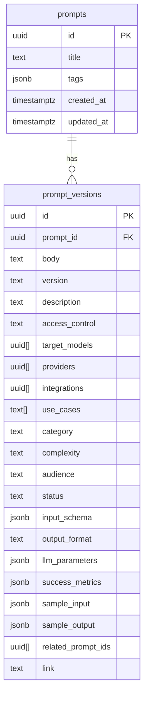

# User Story — **MP-PMT-002 Prompt Metadata Expansion & UI Enhancements**

| Field            | Value                                                                             |
| ---------------- | --------------------------------------------------------------------------------- |
| **Epic / Theme** | Prompt Vault – Authoring & Governance                                             |
| **Story ID**     | MP-PMT-002                                                                        |
| **Title**        | Extend Prompt metadata model, CRUD APIs, and UI to support rich governance fields |
| **Author**       | Lead Architect (Nick)                                                             |
| **Stakeholders** | Prompt authors, reviewers, enterprise admins                                      |

---

## 1 · Narrative

> **As a** prompt author
> **I want** to capture rich, structured metadata (e.g., access control, input schema, sample I/O, related prompts) when I create or edit a prompt
> **So that** my team can discover, govern, version, and reuse prompts confidently across providers and toolchains.

---

## 2 · Background / Rationale

Our Prompt Wizard UI already pulls enum lists dynamically from the API .
However, the current schema only stores **title**, **body**, **tags**, and a few enum fields.
Expanding the model now—before production data exists—avoids painful migrations later and sets the stage for analytics, RBAC, and A/B testing.

---

## 3 · Functional Acceptance Criteria

| #         | Given / When / Then                                                                                                                                                                          |
| --------- | -------------------------------------------------------------------------------------------------------------------------------------------------------------------------------------------- |
| **AC-1**  | **Given** I open the “Create Prompt” modal **When** I click “Advanced Metadata” **Then** I can populate every field listed in §4.                                                            |
| **AC-2**  | “Target Models”, “Providers”, and “Integrations” each display an **ⓘ** icon that reveals tooltip content pulled from a centralized metadata store (config JSON or `prompt_fields` DB table). |
| **AC-3**  | **Created** and **Last Modified** timestamps are auto-populated by the DB and update on each revision; timestamps persist per version.                                                       |
| **AC-4**  | **Access Control** supports: *public, private, team-only, role-based*; unauthorized users cannot view private prompts.                                                                       |
| **AC-5**  | **Sample Input** and **Sample Output** use CodeMirror 6 with language selector; default language = “Output Format”.                                                                          |
| **AC-6**  | **Related Prompts** render as hyperlinks on the Prompt Detail view; clicking navigates to that prompt’s card.                                                                                |
| **AC-7**  | Prompt Cards (list view) still only show **Tags**; clicking a card reveals a detail drawer/page showing all populated fields.                                                                |
| **AC-8**  | API validation rejects prompts missing mandatory fields: `title`, `prompt_body`, `use_case`, `access_control`.                                                                               |
| **AC-9**  | Alembic migration runs without errors on an empty DB, creating the new columns and dropping/renaming obsolete ones.                                                                          |
| **AC-10** | Unit + integration tests cover CRUD, RBAC checks, and JSON schema validation for `input_schema` and `llm_parameters`.                                                                        |

---

## 4 · Data-Model & Schema Changes (PostgreSQL + SQLAlchemy)&#x20;

*Auto-timestamps*: `server_default=func.now()`; `onupdate=func.now()`.

---

## 5 · API Surface (FastAPI)

| Endpoint                 | Verb   | Changes                                                                                 |
| ------------------------ | ------ | --------------------------------------------------------------------------------------- |
| `/prompts/`              | `POST` | Accept new metadata fields, validate with Pydantic models (`InputSchema`, `LLMParams`). |
| `/prompts/{id}`          | `GET`  | Option `?include_empty=true` shows blank fields for editing.                            |
| `/prompts/{id}/versions` | `POST` | Creates new `prompt_version` row, copying timestamps.                                   |

---

## 6 · Frontend Tasks (Next.js + NativeWind)

1. **Modal Form**

   * Tabs: *Core*, *Advanced*, *Governance*.
   * Lazy-load CodeMirror for Sample I/O.
2. **Field Info Tooltip**

   * Fetch from `/metadata/fields` (static JSON or DB table).
3. **Prompt Detail Drawer**

   * Collapsible sections; link out to external **Link** URL if present.
4. **State Mgmt**

   * Use TanStack Query for optimistic updates; invalidate list cache on save.

---

## 7 · Config vs. DB for Tooltip Content

* **MVP**: JSON file (`/config/field_help.json`) loaded at build time—fast and cache-able.
* **Future**: Migrate to `prompt_fields` table to enable live edits by admins.

---

## 8 · Testing & QA

| Layer      | Tool                                     | Focus                                           |
| ---------- | ---------------------------------------- | ----------------------------------------------- |
| Unit tests | PyTest                                   | Pydantic validation, access control logic       |
| API tests  | PyTest + HTTPX                           | CRUD round-trips, 401/403 cases                 |
| E2E        | Playwright                               | Create → Edit → Version flow; CodeMirror typing |
| DB         | Alembic autogenerate + pytest-migrations | Migration idempotency                           |

---

## 9 · Documentation & Dev-Rel

* **OpenAPI** regenerated (`make docs`).
* **README** “Prompt Metadata Spec” section.
* **Changelog** entry outlining breaking changes.

---

## 10 · Dependencies / Cross-Story Links

* Relies on **MP-AUTH-001** (RBAC scaffolding).
* Blocks **MP-ANL-001** (Success-metrics dashboard) which needs `success_metrics` data.
* Aligns with **MP-UI-003 Prompt Card Enhancements** to reuse new detail drawer component.

---

## 11 · Future Work / Placeholders

* Allow **Author** to link to MeatyPrompts user profile once user accounts ship.
* Add field-level A/B test IDs and automatic telemetry capture.
* Non-destructive migrations once production data exists.
